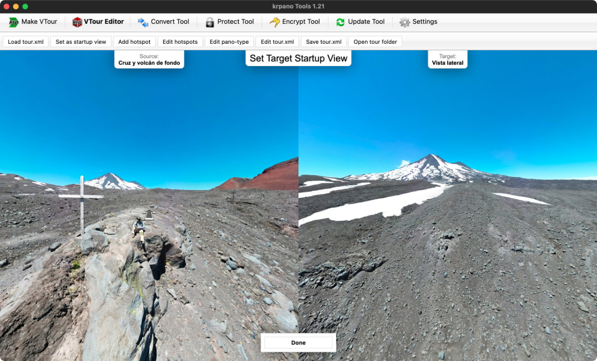

# krpano-circle-hotspots-plugin-plus

`Circle Hotspots Plugin Plus` is an extension of the [`Circle Hotspots Plugin`](https://krpano.com/plugins/userplugins/circlehotspots/#top) from the [krpano](https://krpano.com/) comunity that has the ability to [`lookat`](https://krpano.com/docu/actions/#lookat) after `loadscene` when you click in a circle hotspot.

krpano version **1.21** has the ability to set the StartUp View of the hostspots, generating the tag `linkedscene_lookat`. For example:

```xml
<hotspot name="spot1" style="skin_hotspotstyle" ath="150.293" atv="-33.596" linkedscene="scene_dji_0002" linkedscene_lookat="64.72,13.82,120.0" linkedscene_hoffset="69.61" use3dtransition="true" />
```

You can make it with the `VTour Editor`, from `krpano Tools 1.21` UI:




```xml
<krpano version="1.21" ...>

    ...

    <include url="plugins/circle_hotspots.xml" />

    ...
	
	<scene ...>
		
        ...

		<hotspot name="scene_gs__0728" style="hs_circle" tag="get:sceneNameSobreHielo" ath="39.906" atv="84.119" linkedscene="scene_gs__0728" linkedscene_lookat="-21.45,21.05,120.0" linkedscene_hoffset="290.39" use3dtransition="true" />		
		
		...

	</scene>

</krpano>
```

So, the circle hotspot plugin take the 3 params from `linkedscene_lookat` to apply in the next loaded scene.

